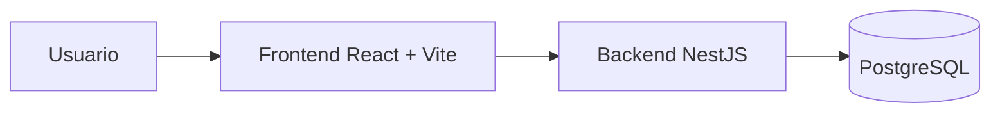
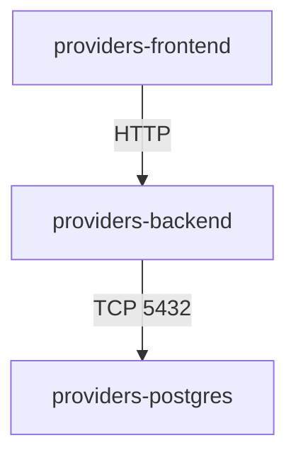
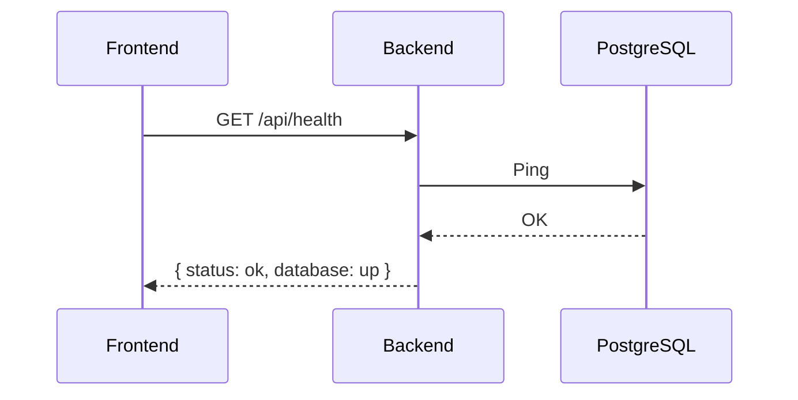

# Architecture

## Vista general

Arquitectura modular y directa. Frontend y backend separados, PostgreSQL como base de datos y Docker Compose para levantar todo junto.



## Backend

```text
backend/
├── src/
│   ├── common/
│   │   ├── decorators/
│   │   └── guards/
│   ├── config/
│   ├── database/
│   │   ├── migrations/
│   │   └── seeds/
│   ├── modules/
│   │   ├── auth/
│   │   ├── health/
│   │   ├── suppliers/
│   │   │   ├── commands/
│   │   │   │   └── handlers/
│   │   │   ├── dto/
│   │   │   ├── queries/
│   │   │   │   └── handlers/
│   │   │   └── strategies/
│   │   └── users/
│   ├── app.module.ts
│   └── main.ts
```

Lo que existe hoy:

- configuracion centralizada
- DataSource de TypeORM
- modulos health, auth, users, suppliers
- CQRS con CommandBus y QueryBus
- Strategy Pattern para validacion de proveedores
- JWT auth con guards y roles
- bootstrap global con CORS, pipes y Swagger

## Frontend

```text
frontend/
├── src/
│   ├── app/
│   │   ├── providers/
│   │   └── router/
│   ├── features/
│   │   └── dashboard/
│   ├── shared/
│   │   └── api/
│   └── styles/
```

Lo que existe hoy:

- providers globales
- router principal
- cliente Axios
- pantalla temporal de infraestructura

## Comunicacion entre servicios

Dentro de Docker:

- frontend publica en `4178`
- backend publica en `3187`
- backend se conecta a `providers-postgres:5432`



## Flujo actual

El frontend consulta `/api/health`. El backend responde solo si NestJS y PostgreSQL estan arriba.



## Estado de la arquitectura

Actualizada al cierre de Fase 3.

Incluye:

- autenticacion JWT con CQRS
- usuarios con roles ADMIN y EXECUTIVE
- modulo suppliers con CQRS real
- Strategy Pattern para validacion por tipo de proveedor
- soft delete
- paginacion, busqueda y filtros
- pruebas unitarias y e2e
