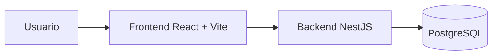
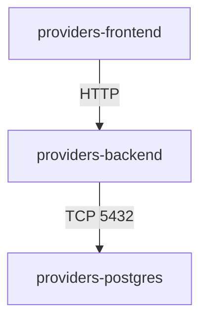
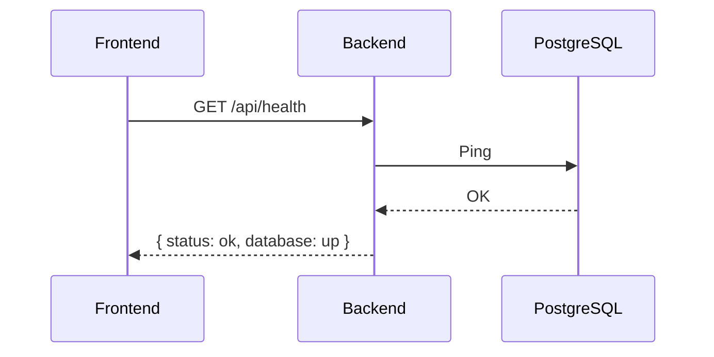

# Architecture

## Vista general

Arquitectura modular y directa. Frontend y backend separados, PostgreSQL como base de datos y Docker Compose para levantar todo junto.



## Backend

```text
backend/
├── src/
│   ├── config/
│   ├── database/
│   ├── modules/
│   │   └── health/
│   ├── app.module.ts
│   └── main.ts
```

Lo que existe hoy:

- configuracion centralizada
- DataSource de TypeORM
- modulo health
- bootstrap global con CORS, pipes y Swagger

## Frontend

```text
frontend/
├── src/
│   ├── app/
│   │   ├── providers/
│   │   └── router/
│   ├── features/
│   │   └── dashboard/
│   ├── shared/
│   │   └── api/
│   └── styles/
```

Lo que existe hoy:

- providers globales
- router principal
- cliente Axios
- pantalla temporal de infraestructura

## Comunicacion entre servicios

Dentro de Docker:

- frontend publica en `4178`
- backend publica en `3187`
- backend se conecta a `providers-postgres:5432`



## Flujo actual

El frontend consulta `/api/health`. El backend responde solo si NestJS y PostgreSQL estan arriba.



## Estado de la arquitectura

Congelada al cierre de Fase 1.

Todavia no entran:

- autenticacion
- usuarios
- CQRS funcional
- modulo de proveedores
